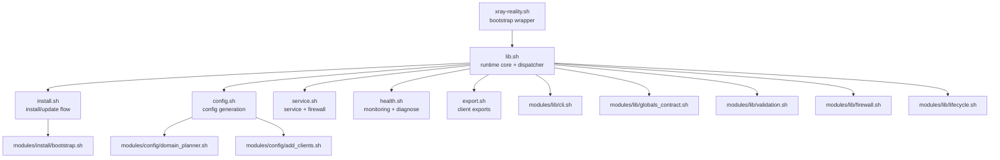
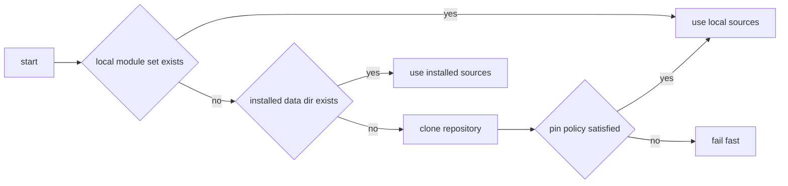
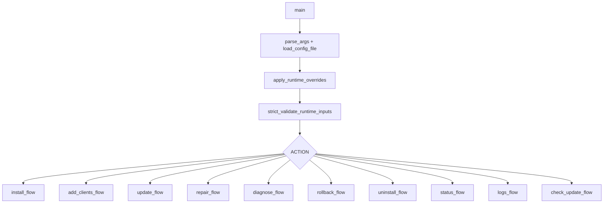
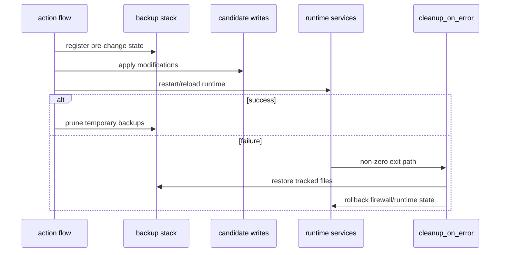

# Architecture

This document describes the runtime architecture of `Xray Reality Ultimate` and the interaction contract between scripts and modules.

## Design goals

- deterministic lifecycle (`install`, `update`, `repair`, `rollback`, `uninstall`)
- strict runtime validation before destructive actions
- transactional writes with rollback on failure
- modular shell code with clear ownership boundaries

## Runtime topology

## Bootstrap stage (`xray-reality.sh`)

Wrapper responsibilities:

1. parse wrapper-level controls (`XRAY_REPO_REF`, `XRAY_REPO_COMMIT`, pin policy)
2. resolve source (local scripts, installed data dir, or git clone)
3. enforce bootstrap pin checks when configured
4. source `lib.sh` and forward action arguments

### Bootstrap resolution flow

## Runtime core (`lib.sh`)

`lib.sh` is the control plane. It centralizes:

- defaults and cross-module globals
- argument parsing and config loading
- strict validation for runtime inputs
- logging, download, backup, rollback helpers
- action dispatch to install/config/service/health/export layers

### Dispatch graph

## Module contracts

| Module | Responsibility | Output Contract |
|---|---|---|
| `modules/lib/globals_contract.sh` | shared global defaults and array declarations | stable `set -u` behavior for all sourced modules |
| `modules/lib/cli.sh` | argument parsing and CLI/env normalization | validated action, runtime flags, and overrides |
| `modules/lib/validation.sh` | validators for domains, ports, IPs, durations, URLs | reusable security checks across flows |
| `modules/lib/firewall.sh` | firewall rule apply/rollback helpers | deterministic network rule lifecycle |
| `modules/lib/lifecycle.sh` | backup stack and rollback orchestration | consistent rollback and cleanup semantics |
| `modules/install/bootstrap.sh` | distro-aware dependency and bootstrap helpers | predictable package/install behavior |
| `modules/config/domain_planner.sh` | domain ranking, quarantine, planning | bounded no-repeat domain allocation |
| `modules/config/add_clients.sh` | `add-clients`/`add-keys` mutation logic | synchronized client artifacts and inbounds |

## Transaction model

All mutating actions are designed as transactions:

1. create backup snapshot for critical files/state
2. apply candidate changes to temporary or staged paths
3. validate candidate (`xray -test` and runtime guards)
4. commit changes atomically
5. rollback automatically on failure

### Failure path

## Domain planning and health feedback

Domain selection is not random-only. The planner combines:

- static tier/custom inputs
- health ranking from `DOMAIN_HEALTH_FILE`
- quarantine based on fail streak and cooldown
- no-repeat sequencing until pool exhaustion

This reduces repetitive traffic patterns and avoids persistently failing domains.

## Generated artifacts

| Path | Produced By | Intended Permissions |
|---|---|---|
| `/etc/xray/config.json` | `config.sh` | `0640`, `root:xray` |
| `/etc/xray-reality/config.env` | `config.sh` | `0600`, root-only |
| `/etc/xray/private/keys/keys.txt` | `config.sh` | `0400`, `root:root` |
| `/etc/xray/private/keys/clients.txt` | `config.sh` | `0640`, `root:xray` |
| `/etc/xray/private/keys/clients.json` | `config.sh` | `0640`, `root:xray` |
| `/var/lib/xray/domain-health.json` | `health.sh` | runtime state file |
| `/etc/systemd/system/xray.service` | `service.sh` | service unit with restrictive settings |

## QA and release control layers

The project keeps three quality layers:

- local: `make lint`, `make test`, `make release-check`
- CI: lint + tests + audits + smoke matrix
- release: consistency checks and artifact policy gates

This structure keeps daily development fast while preserving release integrity.
