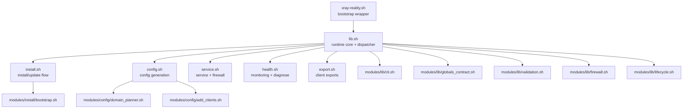
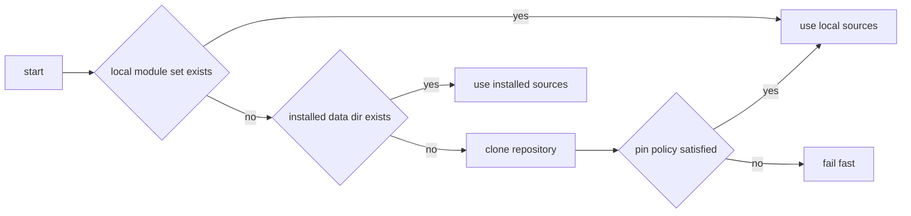
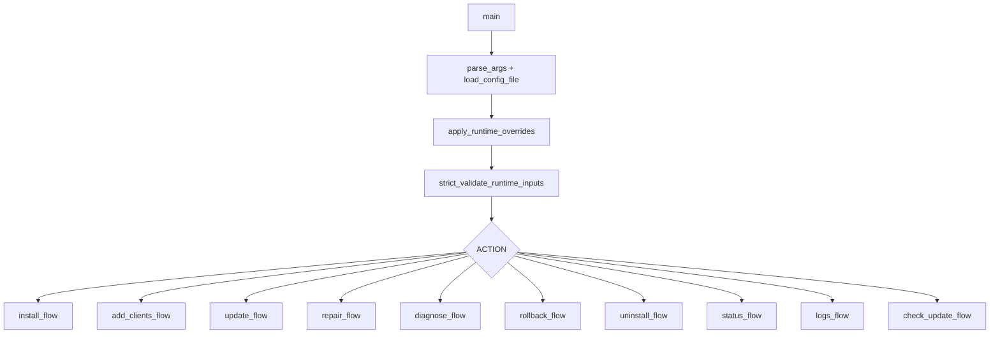
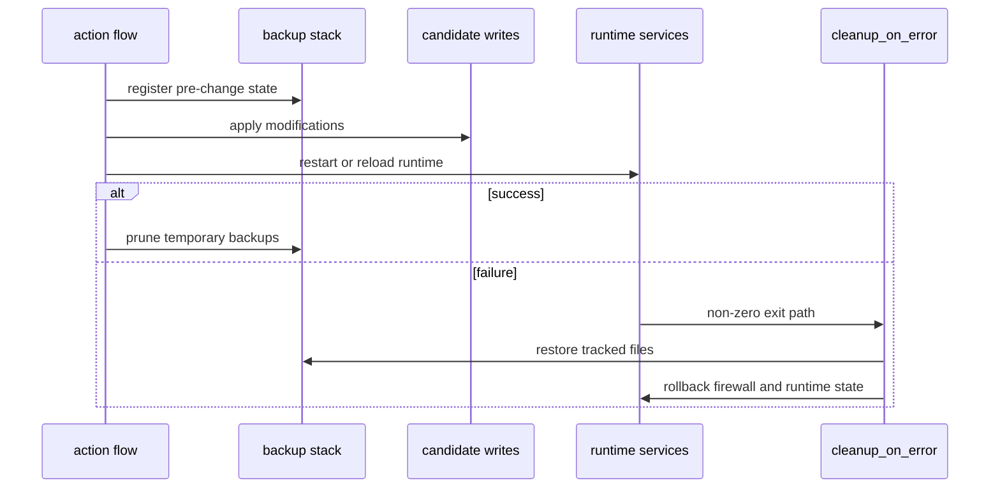

# Architecture

This document describes runtime architecture and module contracts in **Network Stealth Core**.

## Design goals

- deterministic lifecycle: `install`, `update`, `repair`, `rollback`, `uninstall`
- strict runtime validation before destructive actions
- transactional writes with rollback support
- modular shell code with explicit ownership boundaries

## Runtime topology

## Bootstrap stage (`xray-reality.sh`)

Wrapper responsibilities:

1. parse wrapper-level controls (`XRAY_REPO_REF`, `XRAY_REPO_COMMIT`, pin policy)
2. resolve source (local scripts, installed data dir, or git clone)
3. enforce bootstrap pin checks when configured
4. source `lib.sh` and forward action arguments

### Bootstrap resolution flow

## Runtime control plane (`lib.sh`)

`lib.sh` centralizes:

- defaults and cross-module globals
- argument parsing and config loading
- strict validation of runtime inputs
- logging, download, backup, rollback helpers
- action dispatch to install/config/service/health/export layers

### Dispatch graph

## Module contracts

| Module | Responsibility | Contract |
|---|---|---|
| `modules/lib/globals_contract.sh` | shared defaults and array declarations | stable `set -u` behavior across sourced modules |
| `modules/lib/cli.sh` | argument parsing and CLI/env normalization | validated action and runtime overrides |
| `modules/lib/validation.sh` | validators for domains, ports, IPs, ranges, URLs | reusable security checks across flows |
| `modules/lib/firewall.sh` | firewall apply and rollback helpers | deterministic network rule lifecycle |
| `modules/lib/lifecycle.sh` | backup stack and rollback orchestration | consistent rollback semantics |
| `modules/install/bootstrap.sh` | distro-aware bootstrap helpers | predictable dependency/install path |
| `modules/config/domain_planner.sh` | ranking, quarantine, selection planning | bounded no-repeat domain allocation |
| `modules/config/add_clients.sh` | `add-clients` mutation logic | synchronized client artifacts and inbounds |

## Transaction model

Every mutating action follows one pattern:

1. capture backup snapshot of critical state
2. build candidate changes in staged files
3. validate candidate (`xray -test` and runtime guards)
4. commit atomically
5. rollback automatically on non-zero failure path

### Failure path

## Domain planning and health feedback

Domain selection is adaptive, not random-only. Planner inputs:

- static tier or custom list
- health ranking from `DOMAIN_HEALTH_FILE`
- quarantine based on fail streak and cooldown
- no-repeat sequence until pool exhaustion

This reduces repetitive traffic patterns and avoids persistently failing domains.

## Generated artifacts

| Path | Produced by | Intended permissions |
|---|---|---|
| `/etc/xray/config.json` | `config.sh` | `0640`, `root:xray` |
| `/etc/xray-reality/config.env` | `config.sh` | `0600`, root-only |
| `/etc/xray/private/keys/keys.txt` | `config.sh` | `0400`, `root:root` |
| `/etc/xray/private/keys/clients.txt` | `config.sh` | `0640`, `root:xray` |
| `/etc/xray/private/keys/clients.json` | `config.sh` | `0640`, `root:xray` |
| `/var/lib/xray/domain-health.json` | `health.sh` | runtime state file |
| `/etc/systemd/system/xray.service` | `service.sh` | hardened service unit |

## Quality and release gates

Three control layers:

- local: `make lint`, `make test`, `make release-check`
- CI: lint + tests + audits + Ubuntu smoke
- release: consistency checks and release policy gate

This keeps daily development fast while preserving release integrity.
