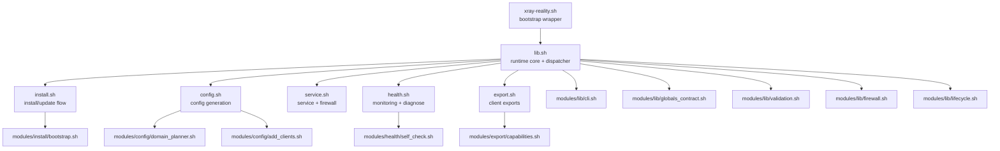
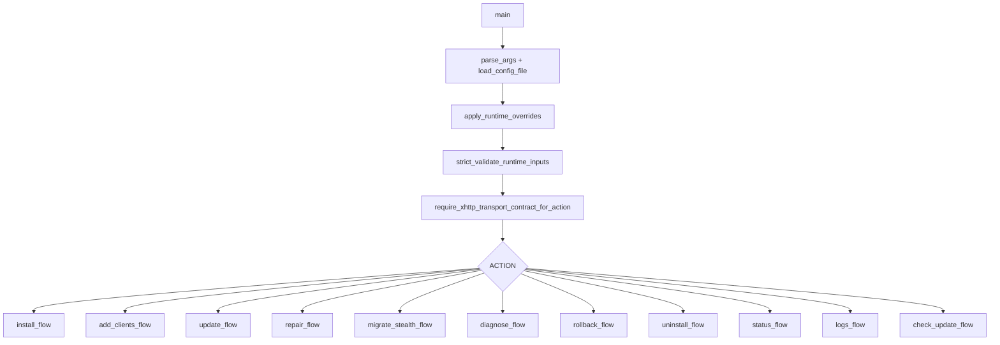

# Architecture

This document describes runtime architecture and module contracts in **Network Stealth Core**.

## Design goals

- deterministic lifecycle: `install`, `update`, `repair`, `rollback`, `uninstall`
- xhttp-only strongest-default install path
- strict runtime validation before destructive actions
- transport-aware post-change validation from generated client artifacts
- transactional writes with rollback support
- modular shell code with explicit ownership boundaries

## Runtime topology

## Bootstrap stage (`xray-reality.sh`)

Wrapper responsibilities:

1. parse wrapper-level controls (`XRAY_REPO_REF`, `XRAY_REPO_COMMIT`, pin policy)
2. resolve source (local scripts, installed data dir, or git clone)
3. enforce bootstrap pin checks when configured
4. source `lib.sh` and forward action arguments

## Runtime control plane (`lib.sh`)

`lib.sh` centralizes:

- defaults and cross-module globals
- argument parsing and config loading
- strict validation of runtime inputs
- xhttp-only action contract for mutating flows
- logging, download, backup, rollback helpers
- action dispatch to install/config/service/health/export layers

### Dispatch graph

## Module contracts

| Module | Responsibility | Contract |
|---|---|---|
| `modules/lib/globals_contract.sh` | shared defaults and array declarations | stable `set -u` behavior across sourced modules |
| `modules/lib/cli.sh` | argument parsing and CLI/env normalization | validated action and runtime overrides |
| `modules/lib/validation.sh` | validators for domains, ports, IPs, ranges, URLs | reusable security checks across flows |
| `modules/lib/firewall.sh` | firewall apply and rollback helpers | deterministic network rule lifecycle |
| `modules/lib/lifecycle.sh` | backup stack and rollback orchestration | consistent rollback semantics |
| `modules/install/bootstrap.sh` | distro-aware bootstrap helpers | predictable dependency/install path |
| `modules/config/domain_planner.sh` | ranking, quarantine, selection planning | bounded no-repeat domain allocation |
| `modules/config/add_clients.sh` | `add-clients` mutation logic | synchronized client artifacts and validated post-change state |
| `modules/health/self_check.sh` | transport-aware validation engine | canonical post-action verdicts from raw xray artifacts |
| `modules/export/capabilities.sh` | export capability matrix | explicit, machine-readable export support surface |

## Transaction model

Every mutating action follows one pattern:

1. capture backup snapshot of critical state
2. build candidate changes in staged files
3. validate candidate (`xray -test` and runtime guards)
4. apply atomically
5. run transport-aware self-check from generated raw client artifacts
6. rollback automatically on broken verdict or non-zero failure path

## Transport-aware self-check

The self-check engine uses canonical exported client artifacts instead of ad hoc regenerated probes.

Inputs:

- `/etc/xray/private/keys/clients.json`
- `export/raw-xray/*.json`
- `SELF_CHECK_URLS`
- `SELF_CHECK_TIMEOUT_SEC`

Outputs:

- `/var/lib/xray/self-check.json`
- verbose status summary
- diagnose snapshot block

Verdict policy:

- `recommended` passes → `ok`
- `recommended` fails but `rescue` passes → `warning`
- both fail → `broken` and mutating flow rolls back

## Generated artifacts

| Path | Produced by | Intended permissions |
|---|---|---|
| `/etc/xray/config.json` | `config.sh` | `0640`, `root:xray` |
| `/etc/xray-reality/config.env` | `config.sh` | `0600`, root-only |
| `/etc/xray/private/keys/keys.txt` | `config.sh` | `0400`, `root:root` |
| `/etc/xray/private/keys/clients.txt` | `config.sh` | `0640`, `root:xray` |
| `/etc/xray/private/keys/clients.json` | `config.sh` | `0640`, `root:xray`, schema v2 with `variants[]` |
| `/etc/xray/private/keys/export/raw-xray/*` | `config.sh` / `export.sh` | `0640`, `root:xray` |
| `/etc/xray/private/keys/export/capabilities.json` | `export.sh` | `0640`, `root:xray` |
| `/etc/xray/private/keys/export/compatibility-notes.txt` | `export.sh` | `0640`, `root:xray` |
| `/var/lib/xray/self-check.json` | `self_check.sh` | `0640`, `root:xray` |
| `/var/lib/xray/domain-health.json` | `health.sh` | runtime state file |
| `/etc/systemd/system/xray.service` | `service.sh` | hardened service unit |

## Export capability model

xhttp artifacts are intentionally split by honesty level:

- `native`: `clients.txt`, `clients.json`, `raw-xray`
- `link-only`: `v2rayn-links.json`, `nekoray-template.json`
- `unsupported`: `sing-box`, `clash-meta`

The machine-readable source of truth is `export/capabilities.json`.

## Measurement harness

`scripts/measure-stealth.sh` reuses the same probe engine as runtime self-check.
It reads `clients.json`, tests requested variants, and writes a JSON report suitable for field comparison.

## Quality and release gates

Three control layers:

- local: `make lint`, `make test`, `make release-check`
- CI: lint + tests + audits + Ubuntu smoke
- release: consistency checks, tag policy, and GitHub release assets

This keeps daily development fast while preserving release integrity.
