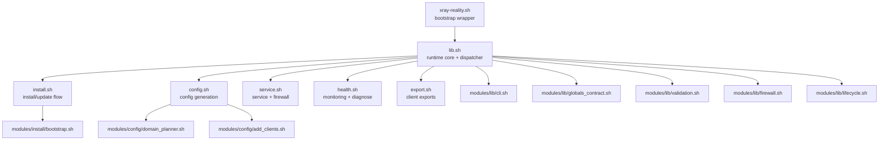

# Архитектура

Документ описывает архитектуру рантайма **Network Stealth Core** и контракты между модулями.

## Цели дизайна

- детерминированный lifecycle: `install`, `update`, `repair`, `rollback`, `uninstall`
- строгая валидация до destructive-операций
- транзакционная запись файлов с rollback
- модульная shell-структура с явным разделением ответственности

## Топология рантайма

## Этап bootstrap (`xray-reality.sh`)

Wrapper выполняет:

1. разбор wrapper-переменных (`XRAY_REPO_REF`, `XRAY_REPO_COMMIT`, pin policy)
2. выбор источника (локальные скрипты, установленный data-dir или git clone)
3. проверку pin-контракта bootstrap
4. source `lib.sh` и передачу action-аргументов

## Control plane (`lib.sh`)

`lib.sh` централизует:

- глобальные дефолты
- разбор аргументов и загрузку runtime-конфига
- строгую проверку входных параметров
- logging, download, backup, rollback helper-функции
- dispatch в install/config/service/health/export слои

## Контракты модулей

| Модуль | Ответственность | Контракт |
|---|---|---|
| `modules/lib/globals_contract.sh` | общие defaults и объявления массивов | стабильная работа при `set -u` |
| `modules/lib/cli.sh` | CLI parsing и нормализация env | валидированные action/flags/override |
| `modules/lib/validation.sh` | валидаторы доменов, портов, IP и диапазонов | переиспользуемые security-checks |
| `modules/lib/firewall.sh` | apply/rollback firewall-правил | детерминированный lifecycle сетевых правил |
| `modules/lib/lifecycle.sh` | backup stack и rollback orchestration | единая модель восстановления |
| `modules/install/bootstrap.sh` | distro-aware bootstrap helpers | предсказуемое поведение на install path |
| `modules/config/domain_planner.sh` | ranking/quarantine/domain-plan | no-repeat распределение доменов |
| `modules/config/add_clients.sh` | `add-clients` и `add-keys` логика | синхронная генерация артефактов |

## Транзакционная модель изменений

Для мутаций используется единый шаблон:

1. снимок backup для критичных файлов
2. запись кандидата в staged-файл
3. валидация кандидата (`xray -test`)
4. атомарный commit в целевой путь
5. автоматический rollback при ошибке

## Планировщик доменов

Планировщик использует:

- tier/custom список
- health ranking из `DOMAIN_HEALTH_FILE`
- quarantine по fail streak/cooldown
- no-repeat распределение до исчерпания пула

Это уменьшает повторяемые паттерны и исключает зацикливание на нестабильном домене.

## Генерируемые артефакты

| Путь | Генератор | Права доступа |
|---|---|---|
| `/etc/xray/config.json` | `config.sh` | `0640`, `root:xray` |
| `/etc/xray-reality/config.env` | `config.sh` | `0600`, root-only |
| `/etc/xray/private/keys/keys.txt` | `config.sh` | `0400`, `root:root` |
| `/etc/xray/private/keys/clients.txt` | `config.sh` | `0640`, `root:xray` |
| `/etc/xray/private/keys/clients.json` | `config.sh` | `0640`, `root:xray` |
| `/var/lib/xray/domain-health.json` | `health.sh` | runtime state |
| `/etc/systemd/system/xray.service` | `service.sh` | hardened unit |

## Качество и релизные gate

Три слоя контроля:

- локально: `make lint`, `make test`, `make release-check`
- CI: lint + tests + audits + Ubuntu smoke
- релиз: consistency checks и policy gate
