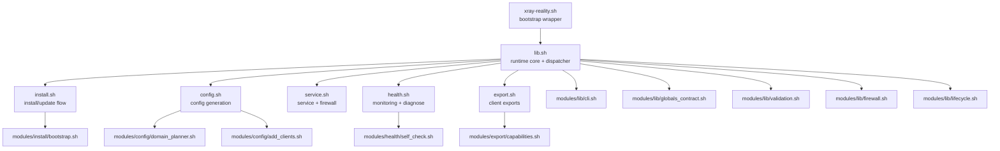
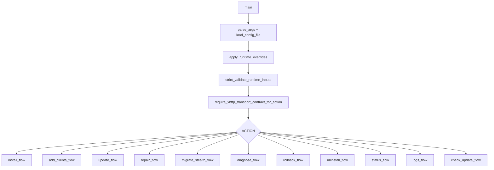

# Архитектура

Этот документ описывает runtime-архитектуру и контракты модулей **Network Stealth Core**.

## Цели дизайна

- детерминированный lifecycle: `install`, `update`, `repair`, `rollback`, `uninstall`
- xhttp-only strongest-default путь установки
- строгая runtime-валидация перед destructive-действиями
- transport-aware post-change проверка по сгенерированным клиентским артефактам
- транзакционные записи с поддержкой rollback
- модульный shell-код с явными границами ответственности

## Runtime topology

## Bootstrap stage (`xray-reality.sh`)

Wrapper отвечает за:

1. разбор wrapper-level controls (`XRAY_REPO_REF`, `XRAY_REPO_COMMIT`, pin policy)
2. выбор source (local scripts, installed data dir или git clone)
3. bootstrap pin checks, если они включены
4. `source` для `lib.sh` и передачу action arguments дальше

## Runtime control plane (`lib.sh`)

`lib.sh` централизует:

- defaults и cross-module globals
- разбор аргументов и загрузку config
- strict validation runtime-входов
- xhttp-only контракт mutating-flow
- logging, download, backup и rollback helpers
- dispatch в install/config/service/health/export layers

### Dispatch graph

## Контракты модулей

| Модуль | Ответственность | Контракт |
|---|---|---|
| `modules/lib/globals_contract.sh` | shared defaults и объявления массивов | стабильное `set -u` поведение между sourced-модулями |
| `modules/lib/cli.sh` | разбор аргументов и нормализация CLI/env | валидные action и runtime overrides |
| `modules/lib/validation.sh` | валидаторы доменов, портов, IP, диапазонов, URL | переиспользуемые security checks |
| `modules/lib/firewall.sh` | firewall apply и rollback helpers | детерминированный lifecycle сетевых правил |
| `modules/lib/lifecycle.sh` | backup stack и rollback orchestration | единая семантика rollback |
| `modules/install/bootstrap.sh` | distro-aware bootstrap helpers | предсказуемый dependency/install path |
| `modules/config/domain_planner.sh` | ranking, quarantine, selection planning | bounded no-repeat allocation доменов |
| `modules/config/add_clients.sh` | логика `add-clients` | синхронные client artifacts и валидированное post-change состояние |
| `modules/health/self_check.sh` | transport-aware validation engine | canonical post-action verdict по raw xray artifacts |
| `modules/export/capabilities.sh` | capability matrix экспортов | явная machine-readable поверхность поддержки форматов |

## Транзакционная модель

Каждое mutating-действие следует одному шаблону:

1. захват backup snapshot критичного состояния
2. сборка candidate changes в staged files
3. валидация candidate (`xray -test` и runtime guards)
4. atomic apply
5. transport-aware self-check по сгенерированным raw client artifacts
6. автоматический rollback при broken verdict или non-zero failure path

## Transport-aware self-check

Self-check engine использует canonical exported client artifacts, а не ad hoc regenerated probes.

Входы:

- `/etc/xray/private/keys/clients.json`
- `export/raw-xray/*.json`
- `SELF_CHECK_URLS`
- `SELF_CHECK_TIMEOUT_SEC`

Выходы:

- `/var/lib/xray/self-check.json`
- summary в verbose status
- блок в diagnose

Политика verdict:

- `recommended` проходит → `ok`
- `recommended` падает, но `rescue` проходит → `warning`
- оба падают → `broken`, и mutating-flow делает rollback

## Генерируемые артефакты

| Путь | Кто создает | Ожидаемые права |
|---|---|---|
| `/etc/xray/config.json` | `config.sh` | `0640`, `root:xray` |
| `/etc/xray-reality/config.env` | `config.sh` | `0600`, только root |
| `/etc/xray/private/keys/keys.txt` | `config.sh` | `0400`, `root:root` |
| `/etc/xray/private/keys/clients.txt` | `config.sh` | `0640`, `root:xray` |
| `/etc/xray/private/keys/clients.json` | `config.sh` | `0640`, `root:xray`, schema v2 с `variants[]` |
| `/etc/xray/private/keys/export/raw-xray/*` | `config.sh` / `export.sh` | `0640`, `root:xray` |
| `/etc/xray/private/keys/export/capabilities.json` | `export.sh` | `0640`, `root:xray` |
| `/etc/xray/private/keys/export/compatibility-notes.txt` | `export.sh` | `0640`, `root:xray` |
| `/var/lib/xray/self-check.json` | `self_check.sh` | `0640`, `root:xray` |
| `/var/lib/xray/domain-health.json` | `health.sh` | runtime-state файл |
| `/etc/systemd/system/xray.service` | `service.sh` | hardened service unit |

## Модель export capability

xhttp-артефакты намеренно разделены по уровню честности:

- `native`: `clients.txt`, `clients.json`, `raw-xray`
- `link-only`: `v2rayn-links.json`, `nekoray-template.json`
- `unsupported`: `sing-box`, `clash-meta`

Machine-readable source of truth — `export/capabilities.json`.

## Measurement harness

`scripts/measure-stealth.sh` использует тот же probe-engine, что и runtime self-check.
Он читает `clients.json`, тестирует requested variants и пишет JSON-report для полевых сравнений.

## Quality и release gates

Три слоя контроля:

- local: `make lint`, `make test`, `make release-check`
- CI: lint + tests + audits + Ubuntu smoke
- release: consistency checks, tag policy и GitHub release assets

Это сохраняет скорость ежедневной разработки без потери release-integrity.
